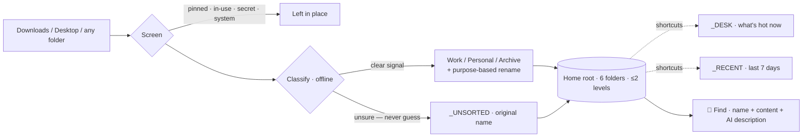

<div align="center">

# 🗂️ Smart File Organizer 4.0 — *Findable First*

**A desk, not a cabinet.** Most file organizers sort everything so thoroughly you can never find anything again. This one sorts *almost nothing* — it surfaces the few files you actually use, keeps the rest in six plain folders, and gives you a Find box that always works.

[](LICENSE)


[](https://github.com/pentestaiCAD/smart-file-organizer-v4/actions/workflows/ci.yml)

</div>

---

## The problem it fixes

> A file that's *"correctly filed"* and still takes 20 minutes to locate has failed.

Version 3 filed every file into a deep tree of type-folders. Technically tidy, practically useless — *"where's that invoice?"* meant remembering it was a PDF, then hunting through 200 other PDFs. **4.0 optimizes for finding, not filing.**

## How it works



## The six folders — and only six

Everything lives under one **Home root** (default `%USERPROFILE%\Organized`):

| Folder | What's in it |
|--------|--------------|
| **`_DESK`** | The few files that matter *now* — modified in the last 3 days, opened 2+ times lately, or pinned. **Shortcuts, not moves.** Never re-sorted. |
| **`_RECENT`** | Everything from the last 7 days. Auto-expires. Also shortcuts. |
| **`Work`** | Confident work files, one subfolder deep at most (`Work\Invoices`). |
| **`Personal`** | Confident personal files. |
| **`Archive`** | Old installers and archives. |
| **`_UNSORTED`** | Anything it can't place confidently. **It never guesses** — the file keeps its original name here rather than getting shoved into the wrong bucket. |

Nothing is ever deeper than **two levels**. One file lives in exactly **one** place — the `_DESK`/`_RECENT` entries are shortcuts, not copies.

## What makes it findable

- **`_DESK`** — the always-visible answer to *"where did I just put that?"*
- **Find** — type any word; it searches **names + file contents + AI descriptions**, so `energy contract` finds `SCE_Agreement_v3_final.pdf`. Contents are read **locally** (SQLite FTS5); only extracted text is ever sent to an AI, and **every** outbound call is logged.
- **Pin / rescue** — pin a file from Find or the Desk and the organizer is *forbidden* to move, rename, or expire it.
- **Undo** — a visible **"Undo last organize"** button restores the entire last batch (moves *and* renames) exactly.

## Names that describe purpose, not type

```text
Downloads\setup.exe     ->  Archive\Installers\Cursor-Setup-0.44.exe
Desktop\invoice.pdf     ->  Work\Invoices\Staples_2026-03-14_paid.pdf
Desktop\resume (3).pdf  ->  Work\Resumes\Jane-Doe_2026-09_resume_v3.pdf
```

Renaming is always previewed (double-click a row in **Tidy** to edit it), only auto-applies when the app is confident, and is fully undoable. If it can't name something well, it keeps the original name.

## Before / after

<table>
<tr><th>A messy folder</th><th>After Tidy</th></tr>
<tr><td valign="top">

```text
Resume_2026-09 (1).pdf
Resume_2026-09 (2).pdf
Resume_2026-09 (3).pdf
invoice.pdf
VSCodeUserSetup-x64.exe
mike_accessKeys.csv
id_ed25519
screenshot.png
setup.exe (1)
desktop.ini
```

</td><td valign="top">

```text
_DESK/    → shortcuts to the hot files
_RECENT/  → last 7 days (shortcuts)
Work/
  Resumes/  Jane-Doe_2026-09_resume_v1..v3.pdf
  Invoices/ Staples_2026-03-14.pdf
Archive/
  Installers/ VSCode-setup.exe
_UNSORTED/ screenshot.png   setup (1).exe
— left in place: mike_accessKeys.csv,
  id_ed25519 (secrets), desktop.ini
```

</td></tr></table>

## Install

**Run from source** (works right away):

```bash
git clone https://github.com/pentestaiCAD/smart-file-organizer-v4.git
cd smart-file-organizer-v4
pip install -r requirements.txt      # optional extras: PDF/Word content search
python app/organizer_gui.py          # or double-click app/Organizer.bat
```

**Packaged installer** — a one-file `SmartFileOrganizerSetup.exe` (Next → Next → Finish; per-user, no admin; first launch runs a short setup wizard). Build it yourself with the steps under [Development](#development), or — once a build has been attached to a [GitHub Release](../../releases) — download it there.

## Command line

The GUI has a scriptable sibling that shares the same rules, journal, index, and pins — so `undo` works no matter which one made the change:

```bash
python app/quicksort.py tidy  "C:\Users\you\Downloads" --dry-run
python app/quicksort.py tidy  "C:\Users\you\Downloads" "C:\Users\you\Desktop"
python app/quicksort.py undo
python app/quicksort.py find  "energy contract"
python app/quicksort.py pin   "C:\path\to\file.pdf"
python app/quicksort.py desk
python app/quicksort.py index --rebuild
python app/quicksort.py watch "C:\Users\you\Downloads"    # notify-only
```

## Architecture

Plain Python standard library at the core (`tkinter`, `sqlite3` + FTS5, `urllib`) — the extras only widen what Find can read.

| Module | Responsibility |
|--------|----------------|
| `engine.py` | plan → preview → execute, journal, exact undo, all safety rules |
| `classify.py` | offline, deterministic bucket + confidence (never AI, never guesses) |
| `namer.py` | purpose-based renaming (offline, optional AI enhancer) |
| `desk.py` | builds the `_DESK` / `_RECENT` shortcut views |
| `index.py` | SQLite FTS5 search + local content extractors (txt/pdf/docx) |
| `usage.py` · `pins.py` | open-count ledger · the untouchable-files registry |
| `shortcuts.py` | `.lnk` creation (batched PowerShell, no admin) |
| `ai_provider.py` | optional OpenRouter / OpenAI / Gemini / Ollama, with a call log + circuit breaker |
| `quicksort.py` · `organizer_gui.py` | the CLI · the Tk GUI |

All per-user data (config, rules, journal, index, usage, pins, `ai-calls.log`) lives in `%APPDATA%\SmartFileOrganizer\` — deliberately **outside** the Home root, so the root stays exactly six folders.

## Safety

- **Never overwrites** — collisions become `name (1).ext`.
- **Never touches** `desktop.ini`, `thumbs.db`, hidden/system files, its own data, or protected locations (`C:\Windows`, `Program Files`, `$Recycle.Bin`, the install dir).
- **Never moves** a pinned file, a file open in another app, or a credential (`.pem`, `id_ed25519`, `*accessKeys*`, wallets…) — those are left in place, never read, never sent to AI.
- **Downloads is never auto-moved** — it's a landing strip, swept only when you click *Clear Downloads*.
- **AI is optional** and off by default; the app is fully functional offline. It's used only for naming and search descriptions — **never** to choose a folder.

## Development

```bash
python tests/smoke_test.py    # 22-check engine smoke test (isolated temp sandbox)
pyinstaller build/SmartFileOrganizer.spec --distpath build/dist --workpath build/work
iscc build/installer.iss      # Inno Setup 6 -> build/output/SmartFileOrganizerSetup.exe
```

Contributions welcome — open an issue or PR. The smoke test runs on every push (see `.github/workflows/ci.yml`); please keep it green.

## License

[MIT](LICENSE) © pentestai
